dtDashboard - Application Data Visualization
================================================================================

## Overview

The App Data Framework collection of UI tools and operator APIs that allows DataTorrent developers to visualize the data flowing through their applications.  This guide assumes the reader’s basic knowledge on the DataTorrent RTS platform and the Console, and the concept of operators in streaming applications.

## Examples

### Twitter Example

The Twitter Hashtag Count Demo, shipped with DataTorrent RTS distribution, is a streaming application that utilizes the App Data Framework.  To demonstrate how the Application Data Framework works on a very high level, on the Application page in the Console, click on the visualize button next to the application name, and a dashboard for the Twitter Hashtag Count Demo will be created.  In it, you will see visualization of the top 10 hashtags computed in the application:

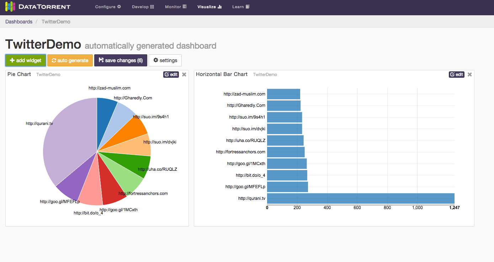

### Ads Dimension Example

The Ads Dimension Demo included in the DataTorrent RTS distribution also utilizes the App Data Framework.  The widgets for this application demonstrates more features than the Twitter one because you can issue your own queries to choose what data you want to visualize.  For example, one might want to visualize the running revenue and cost for advertiser “Starbucks” and publisher “Google”.

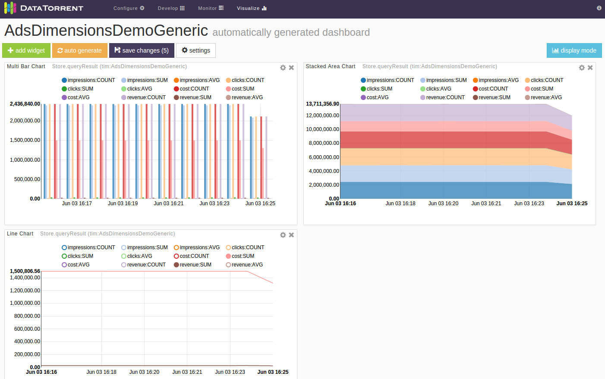

## Data Sources

A Data Source in the application consists of three operators.  The Query Operator, the Data Source Operator and the Result Operator.  The Query Operator takes in queries from a message queue and passes them to the Data Source Operator.  The Data Source Operator processes the queries and sends the results to the Result Operator.  The Result Operator delivers the results to the message queue.  The Data Source Operator generally takes in data from other parts of the DAG.

To see how this is fit in our previous examples, below is the DAG for the Twitter Hashtag Demo:

The operators “Query”, “Tabular Server” and “QueryResult” are the three operators that serve the data being visualized in the Console.  The “Tabular Server” operator takes in data from the TopCounter operator, processes incoming queries, and generates results.

And below is the DAG for the Ads Dimension Demo:

In this DAG, the operators “Query”, “Store” and “QueryResult” are the three operators that make up the Data Source.  The “Store” operator takes in incoming data, stores them in a persistent storage, and serve them.  In other words, the Data Source serves historical data as well as current data, as opposed to the Twitter Hashtag Demo, which only serves the current data.

All these operators are available in the Malhar (and Megh). When you are familiar with how the built-in operators work, you may want to create your own Data Sources in your own application.  [App Data Framework Programming Guide](http://www.datatorrent.com/docs/)

# Stats and Custom Metrics

Each application has statistics such as tuples processed per second, latency, and memory used.  Each operator in an application can contain custom metrics that are part of the application logic.  With the Application Data Framework, each application comes with Data Sources that give out historical and real-time application statistics data and custom metrics data.  You can visualize such data as you would for other Data Sources in the application.

# Data Visualization with Dashboards and Widgets

## Overview

DataTorrent Dashboards and Widgets are UI tools that allow users to quickly and easily visualize historical and real-time application data.  Below is an example of a visualization dashboard with Stacked Area Chart, Pie Chart, Multi Bar Chart, and Table widgets.

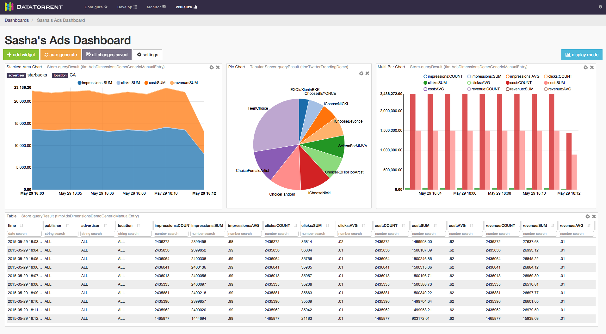

Dashboards are quick and easy to create, and can include data from a single or multiple applications on the same screen.  Widgets can be added, removed, rearranged, and resized at any time.  Each widget provides a unique way to visualizes the application data, and provides a number of ways to configure the content and the corresponding visualizations.

## Accessing Dashboards

Dashboards are accessible from Visualize section in the DataTorrent Console menu.

After selecting Visualize menu item, a list of available dashboards is displayed.  The list of available dashboards can be ordered or filtered by dashboard name, description, included applications, creating user, and modified timestamp.  Clicking one of the dashboard name links takes you to the selected dashboard.

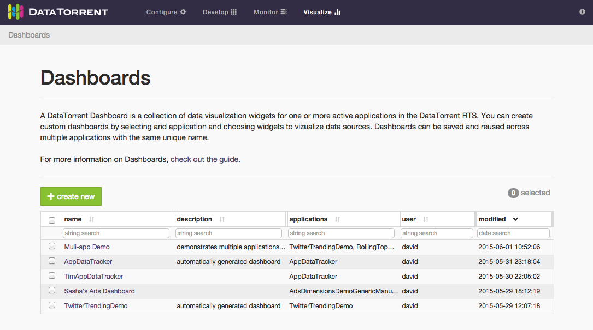

An alternative way to access dashboards is from Monitor section.  Navigate to one of the running applications, and if the application supports data visualization, list of existing dashboards which include selected application will be displayed after clicking on visualize button below the application name.

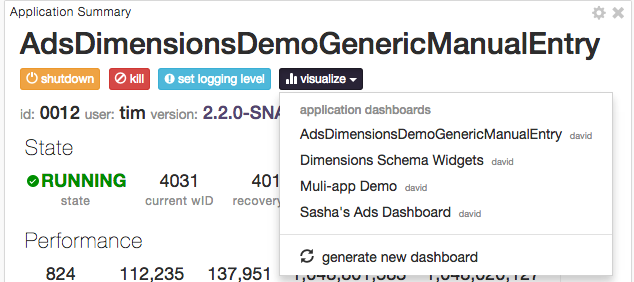

Below is an example of accessing the data visualization dashboard from a running application.

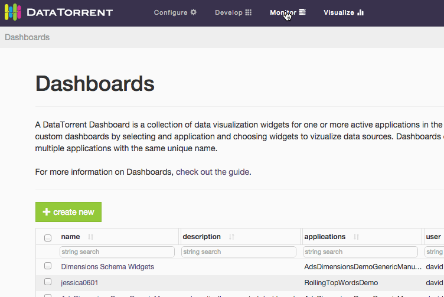

## Creating Dashboards

There are two ways to create a new visualization dashboard

* create new button on the Dashboards screen
* generate new dashboard option in the visualization menu of a compatible running DataTorrent application

Below is an illustrated example and a set of steps for creating a new dashboard from the Dashboards screen using the create new button reatingDashboard.gif](images/dtdashboard/image15.gif)

1.  Provide a unique dashboard name. Names are required to be unique for a single user.  Two different users can have a dashboard with the same name.

2.  Include optional dashboard description.  Descriptions help explain and provide context for visualizations presented in the dashboard to new users, and provide an additional way to search and filter dashboards in the list.

3.  Select compatible applications to include in the data visualizations. Only applications with compatible data visualization sources will be listed.  Any number of applications can be included, and selection can be changed after a dashboard is created.

4.  Choose to automatically generate a new dashboard or create one from scratch. Generating a new dashboard option automatically adds a widget to the new dashboard for every available data source in every selected application.  Creating dashboard from scratch involves manually choosing the widgets to display.

5.  Customize and save the dashboard.  Add, remove, resize, and customize the widgets.  Save the changes to preserve the current dashboard state.

Below is an illustrated example of creating a new dashboard with generate new dashboard option in the visualization menu of a compatible running DataTorrent application.

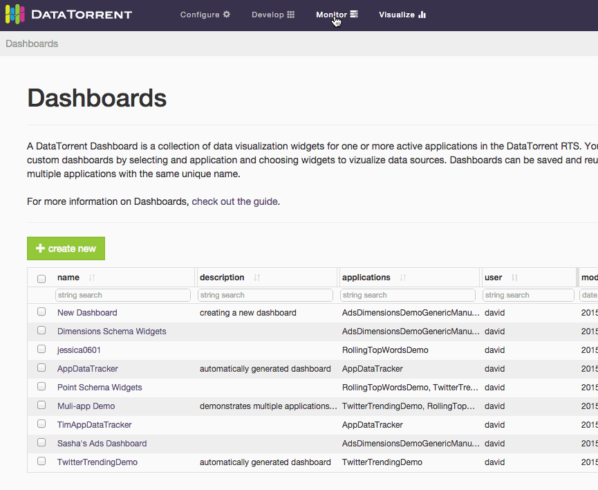

1.  Locate visualize menu in the Application Summary section of a running application.  Only applications with compatible data visualization sources include visualize menu option.

2.  Choose to generate new dashboard from the visualize menu drop-down list.  New dashboard will be automatically named, generated, and saved.  The new dashboard name will reflect the selected application name, and widgets will be automatically added one for every available data source.

3.  Customize and save the dashboard.  Add, remove, resize, and customize the widgets.  Save the changes to preserve the current dashboard state.

## Modifying Dashboards

Dashboards controls are presented as a row of buttons just below the dashboard title and description.

New widgets can be added with settings button allows you to change dashboard name, description, and list of associated applications.  Use the save changes button to persist the dashboard state, which includes any changes made to the dashboard settings or widgets.  And finally, display mode enables an alternative visualization mode, which removes widget controls and backgrounds to create a simplified and seamless viewing experience.

## Widgets Overview

Dashboard widgets receive and display data in real time from DataTorrent application data sources.  Widgets can be added, removed, rearranged, and resized at any time.  Each widgets has a unique list of configurable properties, which include interactive elements displayed directly on the widget, as well as data query settings available from the widget settings.

## Adding Widgets

Widgets can be added to the dashboard by clicking add widget button, selecting one of the available data sources, selecting one or more widgets, and confirming selection by clicking add widget 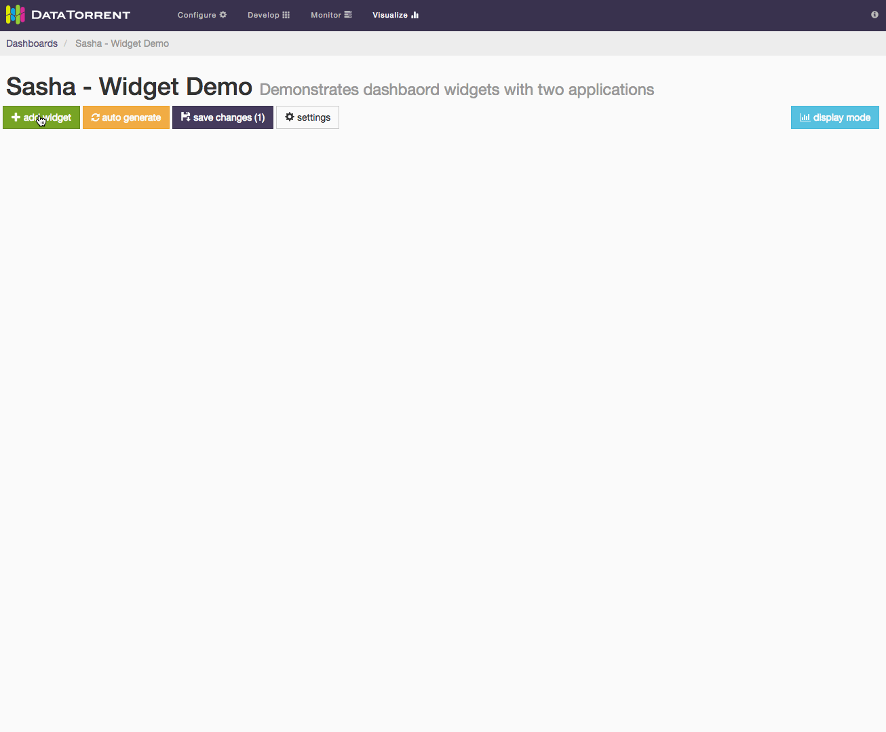

Alternatively, randomly selected widgets, one for every available data source, can be added to the dashboard by clicking auto generate button.  Widgets will be automatically placed on the dashboard without any further dialogs.  If data sources are responding slowly, auto generate may take longer to add new widgets.  During this time the button will remain disabled to avoid duplicate requests, and will show spinning arrows to indicate that previous action is already in progress.

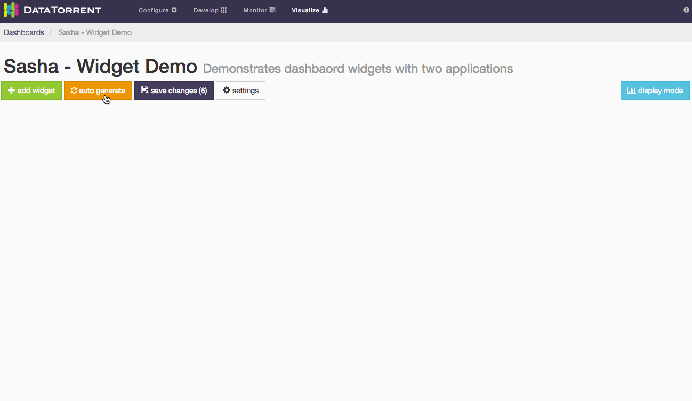

Whether using auto generate buttons, results are not persisted until save changes is applied.

Each data source supports one or more data schema types, such as snapshot, dimensions  Each schema type has a specific list of compatible widgets which can be selected to visualize the data.

## Editing Widgets

Each widget has an dimensions, snapshot) and widget type (table, chart, text For snapshot schema, which represents a single point in time, the primary widget controls include

* label field selection
* quantity field selection
* sort order selection

Below is an example of changing label field and sort order for a bar chart widget.

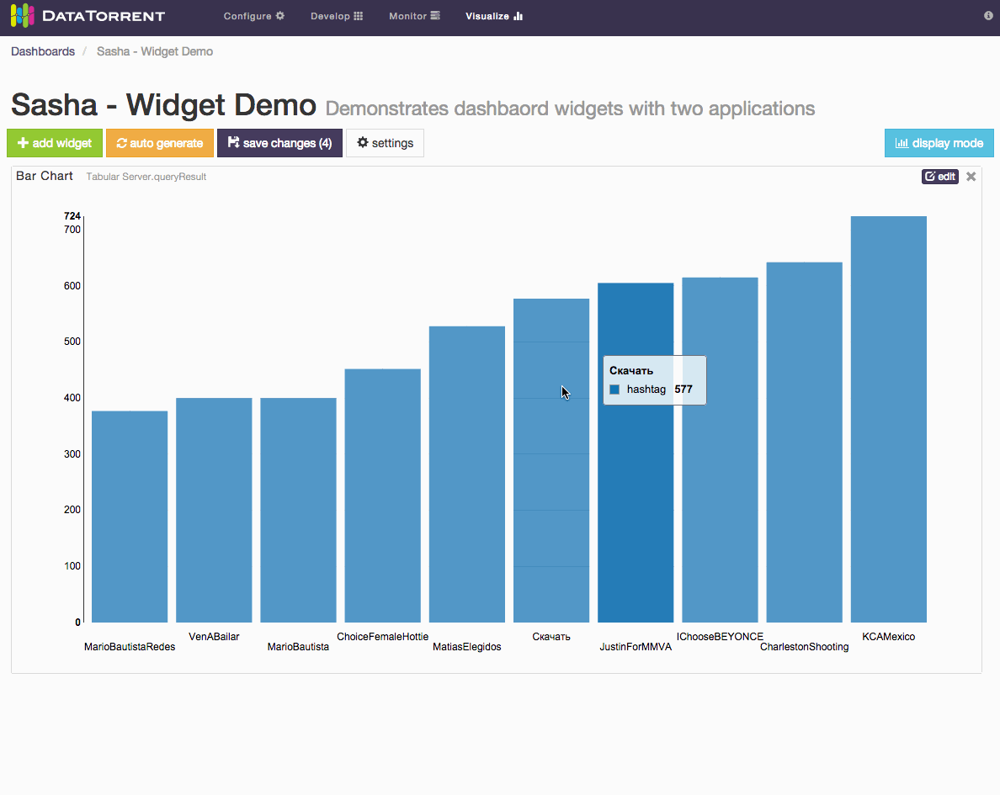

For dimensions schema, which represents a series of points in time, with ability to configure dimensions based on key and value settings, the primary widget controls include

*  Time ranges selection
  *  live streaming
  *  historical range
*  Dimensions Selections
  *  key combinations and key values selection
  *  aggregate selection

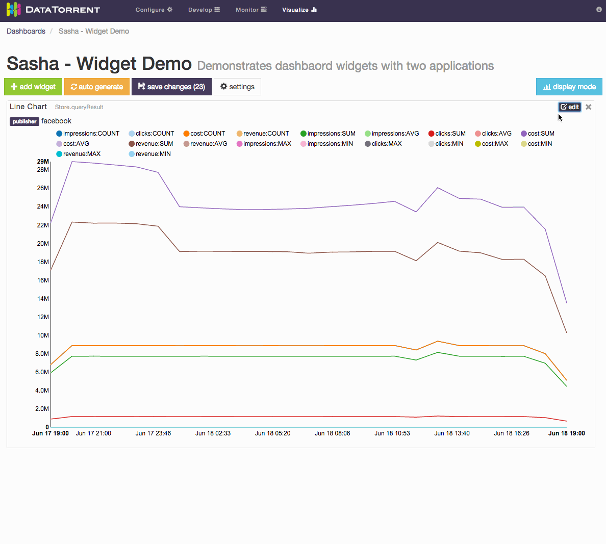

For Notes widget, a text in Markdown format can be entered and should be translated to HTML look.  Below is an example of using Markdown syntax to produce headings, lists, and quoted text.

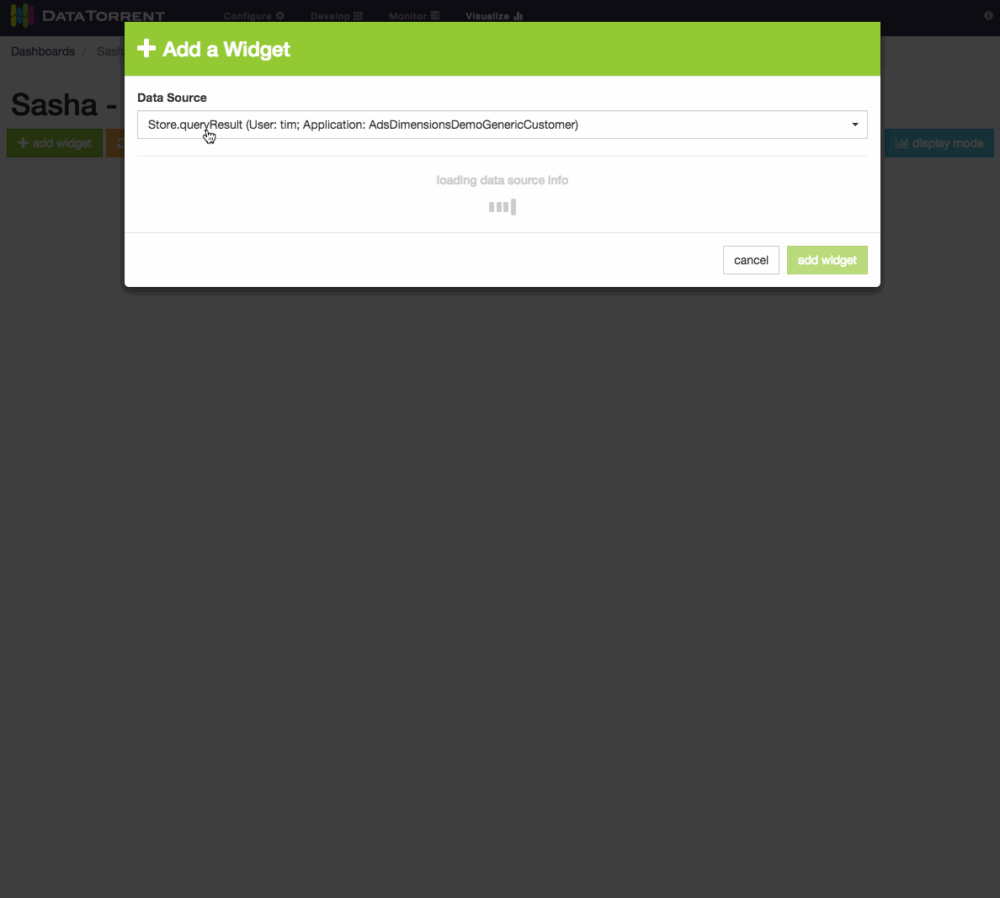

After making the widget settings changes, remember to use save changes button to persist the desired results.  If the resulting changes should not be saved, reloading the dashboard will revert it to the the original state.

