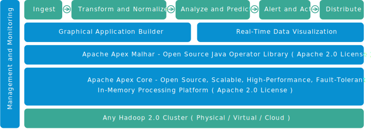

Welcome to the DataTorrent RTS!
================================================================================

This collection of tutorials will introduce you to the DataTorrent RTS platform.

### Getting Started with DataTorrent Applications

To help you get started with creating DataTorrent applications, check out our [Application Development Tutorial](https://www.datatorrent.com/docs/guides/ApplicationDevelopmentTutorial.html)

### Explore the DataTorrent Platform

Use the navigation menu on the left, or interactive architecture diagram below to find out more about the various platform features.

Learn ⇒ Demos ⇒ Write Apps

<iframe width="795" height="448" src="https://www.youtube.com/embed/QmkZFOg-tZA" frameborder="0" allowfullscreen></iframe>

<!--------------------------------- Architecture Diagram Styles ------------------------------------------------->

